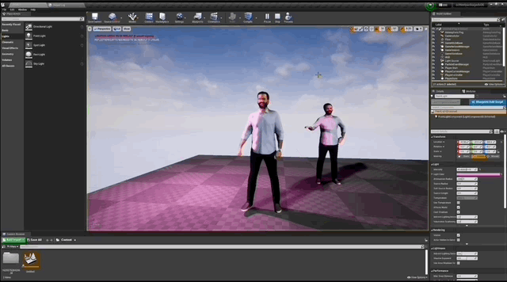
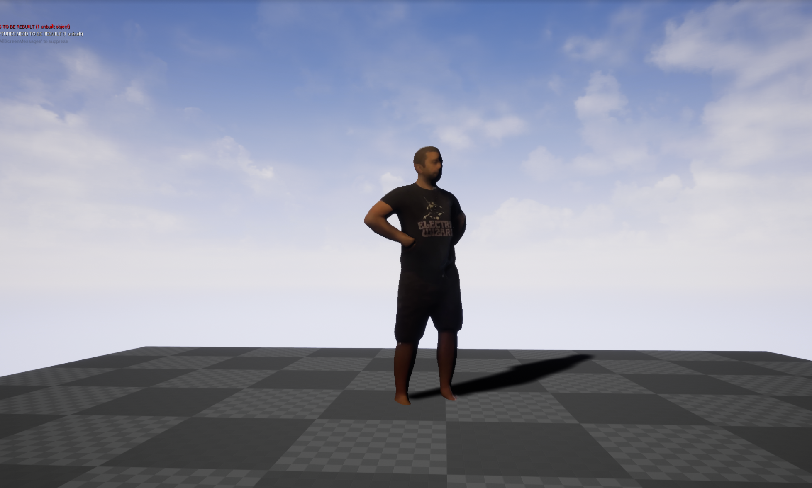
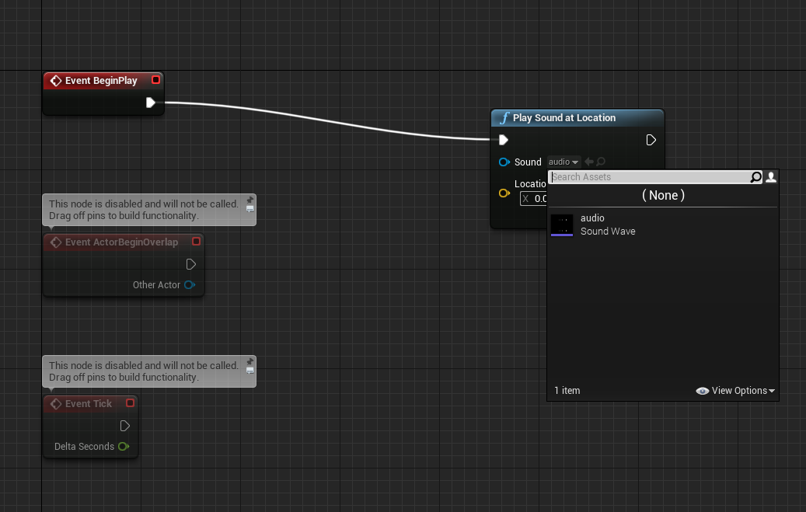

# Volograms Toolkit - Unreal 4 Plugin #

This plugin lets you play [volograms](https://www.volograms.com/) captured either in the studio, or with the [Volu](https://www.volograms.com/volu) mobile app in projects using Epic's [Unreal 4](https://www.unrealengine.com/en-US/) engine.

* Current version:              0.7 (beta)
* Built against Unreal version: 4.27

### Contents and Features of the Plugin ###

* Drag-and-drop *VologramActor* class Blueprint integration for use in the Editor.
* *VologramMaterial* class for the video texture (used automatically by the Actor class).
* C++ access to key functionality from the Volograms SDK if you prefer to customise your own vologram player.
* Unreal users can load and play a vologram without writing any code.

### Operating Systems Supported ###

* Only 64-bit Windows systems are supported currently.
* macOS and iOS are work-in-progress.
* Android is planned for a future version.

### How Do I Get Set Up? ###

These instructions assume you have a volumetric capture on your computer, that you have exported from the [Volu](https://www.volograms.com/volu) app.

_Your exported vologram, unzipped, will have an unique name - mine is called `1625472326152_ld`, and contains the above header, sequence, and video texture files. We will use this plugin to load and play these files from your volograms._

We also assume here that you have used Unreal Engine before, and followed the Unreal C++ set-up tutorial with Visual Studio integration.

* This plugin comes as source code - you'll need Unreal [set up with Visual Studio](https://docs.unrealengine.com/4.27/en-US/ProductionPipelines/DevelopmentSetup/VisualStudioSetup/) to include this plugin in your projects.
* If you don't have an existing Unreal project then create a new game project.
* Download this plugin from the [Releases](https://github.com/Volograms/volograms_unreal4_plugin/releases) page, and unzip into your `<Your Game Folder>/Plugins/` directory.
    * If this is your first plugin in your game you may have to create the `Plugins/` directory.

_I have created a new game project called _unreal4july_, and created the `Plugins/` subdirectory in the same directory as the game's `.uproject` file._

_The Volograms plugin is extracted into its own folder, under the `Plugins` sub-directory._

* Relaunch your game project in the Unreal Editor, and in the *Plugins* menu in Unreal Editor check that the *Volograms* plugin is enabled.
* In the _Place Actors_ panel in the top-left, search for `volograms`.

* Drag the _Vologram Actor_ into your 3D scene.
* In the side context panel that appears when your vologram is selected:
    * Ensure that *VologramMaterial* is selected in the *Material* drop-down.
    * Set the paths to the vologram *header* .vols file,
    * the *sequence* .vols file,
    * and the *video texture* file.

_In the Vologram Actor panel I have made sure the `Material` field is set to `VologramMaterial`, and set the 3 "VOL" file paths to a vologram on my computer._

* Hit *play* to preview your vologram in Unreal.

### Troubleshooting

* _"My vologram is extremely blurry!"_ - Your camera is probably pointing at the rear of the vologram, which is reconstructed and can look blurry. You can rotate the vologram around 180 degrees, or move the camera to the other side.
* _"My vologram is a little blurry!"_ - Default Unreal scenes can use quite a lot of post processing. You can try changing the anti-aliasing method in your Project settings, or tweaking any Post Processing Volume settings in your scene.
* _"The following modules are missing or built with a different engine version."_ - This message box can appear for several reasons.
    1. Visual Studio isn't [linked to Unreal](https://docs.unrealengine.com/4.27/en-US/ProductionPipelines/DevelopmentSetup/VisualStudioSetup/) - you can confirm it works by creating a new C++ game project that includes a class to compile.
    2. The version of Unreal differs signficantly from the version the plugin was built against. This is not usually the case.
    3. Within the volograms plugin in your game, try deleting the `Intermediate/` and `Binaries/` subdirectories to force a rebuild of the plugin. This can occur when copying a built plugin folder from one game project to another.

### Packaging Your Project

* Double-check in the *VologramActor* that the paths to your vologram files will be the correct relative or absolute paths when packaged.
* Because the package will include the Volograms plugin, Unreal requires you to compile your project.
    * If you have a Blueprint project you will need to convert it to C++ first. You can do this by creating a new, blank, C++ file, which will generate a Visual Studio project that you can compile from.

### Adding Audio to the Vologram

* If you have an audio file i.e. a `.wav`, you can drag this into your Unreal Editor content panel to use as an audio source.
* (Optional) Edit your audio source properties to add a 3D attenuation so that the volume decreases as the camera moves away from the vologram.
* Edit your `VologramActor` blueprint Event Graph, and attach a *Play Sound at Location* node to the *BeginPlay* event. Choose your audio source in the drop-down menu.

* If you have audio in your vologram's texture video file, it is possible to play this with your vologram.
* Create a MediaPlayer and file MediaSource, pointing to your video file, in your content tree. 
* Add a MediaPlayer component to your Vologram actor instance, linked to your MediaPlayer.
* Similarly to the above method for sound sources, instead launch an Open Source event linked to a MediaPlayer variable.
* Double check your MediaPlayer has the 'play on open' flag checked.

### Known Issues ###

* Older Volograms may have inconsistent orientation and scale, and earlier versions will be missing normals. If you need to load these let us know.
* There is no built-in demo or functions for seek/rewind/loop yet. We are happy to take feature requests based on early-adopter testing.

### Unity and OpenGL/DirectX Support ###

* See [Volograms on GitHub](https://github.com/Volograms) for an equivalent Unity plugin. You will also find command-line tools, and the libraries used in these plugins, which can be used to build custom players, with success in OpenGL and web assembly.

## Licence ##

Copyright 2022, Volograms.

* Source code included in this plugin is provided under the terms of the MIT licence (see the `LICENSE` file for details).
* Other terms apply to third-party code found in the `Source/volograms/ThirdParty` sub-directory:

### Dependencies

* This software uses unaltered code of <a href=http://ffmpeg.org>FFmpeg</a> licensed under the <a href=http://www.gnu.org/licenses/old-licenses/lgpl-2.1.html>LGPLv2.1</a> and its source code can be found at [FFmpeg](https://github.com/FFmpeg/FFmpeg).

See the `Source/volograms/ThirdParty/ffmpeg/LICENSE.md` file for details.

* The LGPL build of Windows FFmpeg included in this repository uses the binary of the H264 codec [openh264](https://github.com/cisco/openh264) from Cisco, which has the BSD-2-Clause Licence.

> Copyright (c) 2013, Cisco Systems
> All rights reserved.
> 
> Redistribution and use in source and binary forms, with or without modification,
> are permitted provided that the following conditions are met:
> 
> * Redistributions of source code must retain the above copyright notice, this
>   list of conditions and the following disclaimer.
> 
> * Redistributions in binary form must reproduce the above copyright notice, this
>   list of conditions and the following disclaimer in the documentation and/or
>   other materials provided with the distribution.
> 
> THIS SOFTWARE IS PROVIDED BY THE COPYRIGHT HOLDERS AND CONTRIBUTORS "AS IS" AND
> ANY EXPRESS OR IMPLIED WARRANTIES, INCLUDING, BUT NOT LIMITED TO, THE IMPLIED
> WARRANTIES OF MERCHANTABILITY AND FITNESS FOR A PARTICULAR PURPOSE ARE
> DISCLAIMED. IN NO EVENT SHALL THE COPYRIGHT HOLDER OR CONTRIBUTORS BE LIABLE FOR
> ANY DIRECT, INDIRECT, INCIDENTAL, SPECIAL, EXEMPLARY, OR CONSEQUENTIAL DAMAGES
> (INCLUDING, BUT NOT LIMITED TO, PROCUREMENT OF SUBSTITUTE GOODS OR SERVICES;
> LOSS OF USE, DATA, OR PROFITS; OR BUSINESS INTERRUPTION) HOWEVER CAUSED AND ON
> ANY THEORY OF LIABILITY, WHETHER IN CONTRACT, STRICT LIABILITY, OR TORT
> (INCLUDING NEGLIGENCE OR OTHERWISE) ARISING IN ANY WAY OUT OF THE USE OF THIS
> SOFTWARE, EVEN IF ADVISED OF THE POSSIBILITY OF SUCH DAMAGE.
